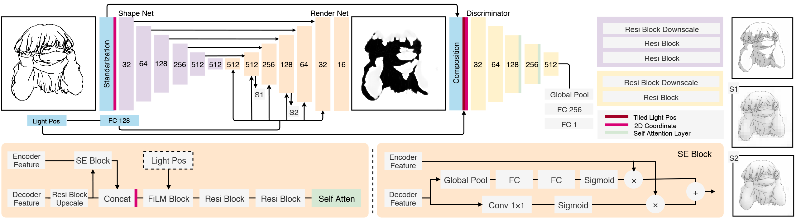
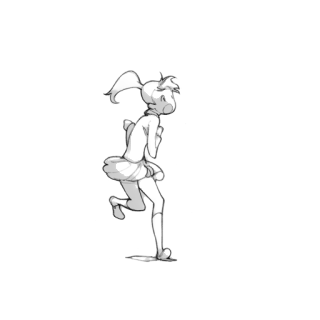
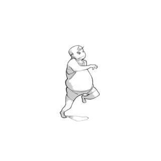
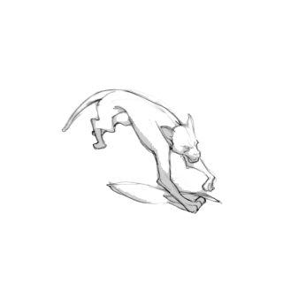
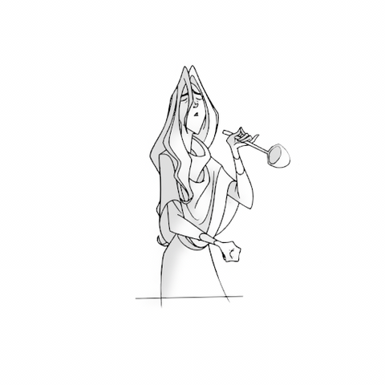
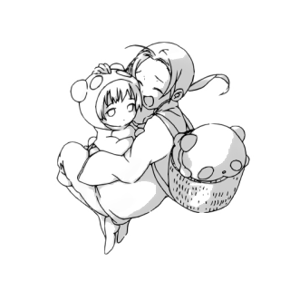
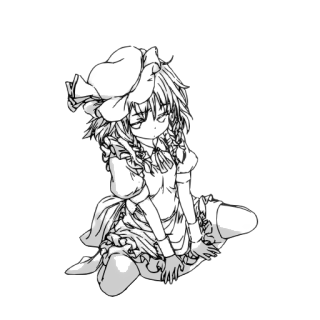
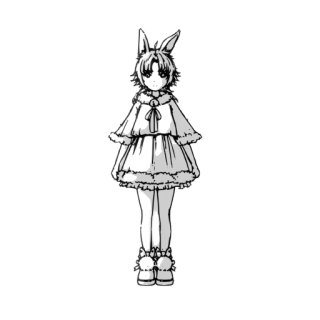
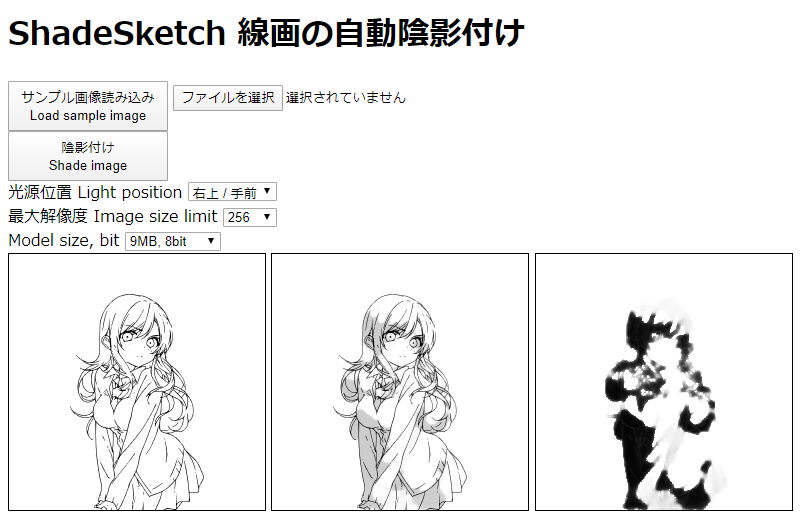
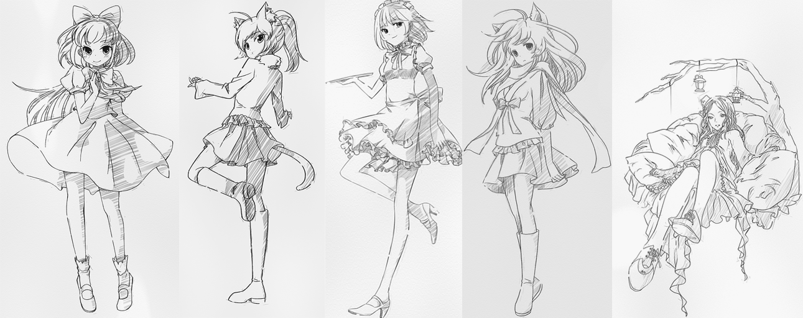

# ShadeSketch

**Official Implementation of "Learning to Shadow Hand-drawn Sketches".**

[Project Site](https://cal.cs.umbc.edu/Papers/Zheng-2020-Shade) | [Paper](https://arxiv.org/abs/2002.11812) | [Online Demo](https://qyzdao.github.io/ShadeSketch/)

[Learning to Shadow Hand-drawn Sketches](https://arxiv.org/abs/2002.11812)

*IEEE Conference on Computer Vision and Pattern Recognition* **CVPR 2020 (Oral)**

[Qingyuan Zheng](https://github.com/qyzdao), [Zhuoru Li (Hepesu)](https://github.com/hepesu), Adam W. Bargteil

## Overview



We present a fully automatic method to generate detailed and accurate artistic shadows from pairs of line drawing sketches and lighting directions. We also contribute a new dataset of one thousand examples of pairs of line drawings and shadows that are tagged with lighting directions. Remarkably, the generated shadows quickly communicate the underlying 3D structure of the sketched scene. Consequently, the shadows generated by our approach can be used directly or as an excellent starting point for artists. We demonstrate that the deep learning network we propose takes a hand-drawn sketch, builds a 3D model in latent space, and renders the resulting shadows. The generated shadows respect the hand-drawn lines and underlying 3D space and contain sophisticated and accurate details, such as self-shadowing effects. Moreover, the generated shadows contain artistic effects, such as rim lighting or halos appearing from back lighting, that would be achievable with traditional 3D rendering methods.

## Prerequisites

- python3
- numpy
- scipy
- matplotlib
- opencv-python
- tensorflow

## Usage

### Training
Download models and dataset to build **`data.npy`** [SEE BELOW](#models). We recommend using batch size of 8 or 4. The model becomes converged after 25k iterations.

For **Tensorflow 1**
```
python ./train_tf1.py
```
For **Tensorflow 2**
```
python ./train_tf2.py
```

### Evaluating
Download models [SEE BELOW](#models).

For **Single Light Direction**, run:
```
python ./predict.py --use-smooth --use-norm --direction 810 --input-dir YOUR_DIR
```
--direction choice: 001, 002 or xy0, where x={1, 2, 3, 4, 5, 6, 7, 8} and y={1, 2, 3}.

For **Changing Light Direction**, run:
```
python ./predict_anim.py --use-smooth --use-norm --light-depth front --input YOUR_IMAGE
```

## Models
Download models from following:
- [ShadeSketch Release Page](https://github.com/qyzdao/ShadeSketch/releases)
- [Google Drive](https://drive.google.com/drive/folders/1KUVw5OXCzc9CVVSg7EnEvYpTOJbCTMUo?usp=sharing)
- [BaiduPan](https://pan.baidu.com/s/1T9V7TYGKk5o86Fbh6IMElg) [Code:t69h]

There are 3 models: **`linenorm.pb`**, **`linesmoother.pb`** and **`lineshader.pb`** . Place models in the **`models`** folder.

## Dataset

Our dataset comprises 1,160 sketch/shadow pairs and includes a variety of lighting directions and subjects. Specifically, 372 front-lighting, 506 side-lighting, 111 back-lighting, 85 center-back, and 86 center-front. With regard to subjects there are 867 single-person, 56 multi-person, 177 body-part, and 60 mecha. 

Download models and **`ShadeSketchDataset`** [HERE](https://forms.gle/C9cRwtsiTKq3GwGC9) then unzip into **`ShadeSketchDataset`** folder. Run the following to get **`data.npy`**: 
```
python ./utils.py
```

## Gallery










## Community Applications

[Unofficial Demo in Japanese](https://shinya7y.github.io/playground/shadesketch/)



Draftify



## License

Pre-trained models and datasets are available under [Creative Commons BY-NC 4.0 license](https://creativecommons.org/licenses/by-nc/4.0/). You can use or redistribute the models and datasets only for **non-commercial purposes**.

## Citation

If you use our work or dataset, please cite our paper.
```
@InProceedings{Zheng2020LSHS,
title = {Learning to Shadow Hand-drawn Sketches},
author = {Zheng, Qingyuan and Li, Zhuoru and Bargteil, Adam},
booktitle = {Proceedings of the IEEE Conference on Computer Vision and Pattern Recognition (CVPR)},
year = {2020}
}
```

## Credits

- Sketches were collected from nico-opendata and web. animation sketches (c) Yoshinari Yo.

- For training line normalization model, please see [LineNormalizer](https://github.com/hepesu/LineNormalizer).
